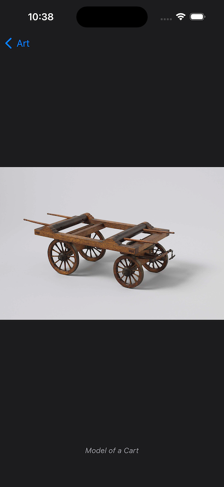

# Art
Uses [Rijksmuseum API](https://data.rijksmuseum.nl/object-metadata/api/) to display art grouped by principal artist/first maker.

## Architecture

Most principles of VIP have been adhered to. One consideration is to pass view models to View/ViewController instead of the simple callbacks at this time of writing. This could allow for more expectable view states and more thorough (snapshot) UI testing scenarios.

## Pagination
Collection requests are limited to 4 items at this time of writing. This is both for demonstration purposes and for network efficiency. One additional page is requested when:

(a) When the current shown item is the last item in the overview and the highest page requested so far incremented by one is less than the total number of pages and has not yet been requested.

(b) The page of the current shown item incremented by one is less than the total number of pages and has not yet been requested. Besides likely always having the next page ready for display and thus providing the most seamless user experience, this also ensures that any missing page gaps due to back-end/networking issues only get requested again when they also likely need to be displayed.

An alternative strategy for (b) could be to check the request/response store for any gaps in the pages whenever another page is requested, and then request the missing pages. At this time of writing the strategy of `the current page +1` always fetches one page ahead of the current page, which could be undesired for very large page sizes/large network requests/responses.

This means there are likely always `page size * 2` items ready to be shown. With a maximum of 3-4 items rendered on screen at one time on current iPhones that provides a sufficient buffer and seamless experience. Art images only begin fetching when the art cell is displayed on screen.

## Image size and caching
### Raw image caching
Raw art images are cached conforming to their URL response cache control protocol. The server response determines the caching behavior such as `Cache-Control: public, max-age=86400, no-transform`.

### Performance
As raw art images are high resolution and high fidelity they require signigicant processing to be rendered on screen. Additionally they can show artifacts when rendered in small sizes. Therefor a thumbnail is generated client-side of a smaller size, perfect for display in an overview/list where buttery smooth UI is paramount. Additionally images are prepared for display asynchronously before being rendered.

### Thumbnail cache
Created thumbnails are cached indefinitely until either (a) the cache count limit is reached or (b) the system evicts cached items due to memory constraints. There is potential for improvement here by providing cost values for each thumbnail, although in the current implementation all thumbnails are largely the same size and cost the same amount of resources to generate.

## Challenges
The Rijksmuseum API has sort and page parameters for art collections. Requesting page 1 with 100 results while sorting by artist returns principalOrFirstMaker `Simon Fokke` at index 99. However requesting page 45 with 100 results while sorting by artist return principalOrFirstMaker `Hector Allemand` at index 0.

While there might be a logical reasoning for this behavior from back-end's side; it does require more care and logic from front-end when grouping/sectioning results alphabetically by `principalOrFirstMaker`. Page objects cannot simply be grouped and appended; in order to maintain correct grouping/sectioning objects need to be inserted into their respective group which could be already existing. Extra thoroughness and rigid UI logic is needed for a solid user experience.

One remaining consideration is that there is a theoretical chance of having subsequent pages return objects whose artist groups are already in the overview and not at the end. This can make it appear as if no more results are being loaded while they are being inserted in their groups higher up in the list. e.g. If page 1 has artist `Simon Fokke`, and all subsequent pages (2, 3, 4 etc.) only have `Hector Allemand`, then the latter pages always get inserted higher up in the list.

## Tests
At this time of writing only the collection worker is fully tested. In the current state all logic and views should be testable. More should be added.

# Screenshots

